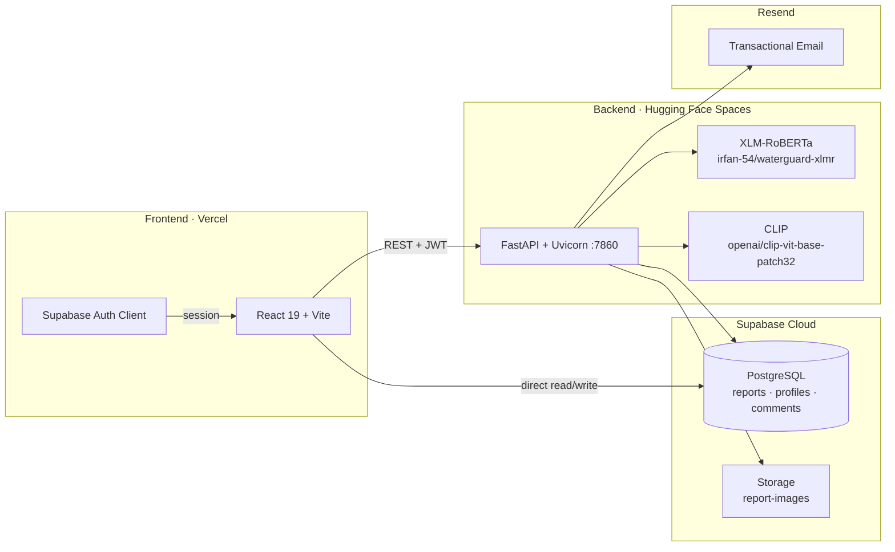

<div align="center">

# 🌊 WaterGuard

**AI-powered civic water issue reporting — multilingual, real-time, role-based.**

[](https://watergaurd-project.vercel.app)

<br/>

[](https://react.dev/)
[](https://fastapi.tiangolo.com/)
[](https://supabase.com/)
[](https://huggingface.co/irfan-54/waterguard-xlmr)
[](https://vercel.com/)
[](https://www.python.org/)
[](LICENSE)

</div>

<hr/>

## ✨ **Features**

### 👤 Citizen
- **Report issues** with description, geolocation (Leaflet map), and optional photo upload
- **Multilingual input** — Tamil Unicode, Tanglish, and English in free-text descriptions
- **Real-time AI triage** — background XLM-RoBERTa + CLIP analysis after submission
- **Track reports** via timeline, status, and risk level on `/track/:reportId`
- **Email notifications** on submit, assign, resolve, and reject (Resend)
- **Google OAuth** or email/password via Supabase Auth

### 🛡️ Admin
- **Central dashboard** — filter, search, and manage all municipal reports
- **Bulk assign** reports to departments by AI category
- **Analytics** — category breakdowns, trends, and heat maps (Recharts + Leaflet)
- **Resolve / reject** workflows with audit trail in `activity_logs`
- **Live stats** — total, active, resolved, high-risk counts from `/stats`

### 🏢 Department
- **Scoped inbox** — only reports matching department category (water / PWD / health)
- **Start work** — move reports from submitted → in progress
- **Resolve with proof** — optional resolution image upload to Supabase Storage
- **Comments** — threaded discussion per report

<hr/>

## 🏗️ **System Architecture**



**End-to-end flow:** Citizen signs in → creates report (`POST /reports`) → image stored in Supabase → row inserted with `ai_processed: false` → FastAPI runs async `run_ai_analysis` (text + image) → updates category, confidence, risk → admin/department acts via role-gated routes → Resend emails citizen at each state change.

<hr/>

## 🧠 **AI Model — XLM-RoBERTa**

| | |
|---|---|
| **Hub model** | [`irfan-54/waterguard-xlmr`](https://huggingface.co/irfan-54/waterguard-xlmr) |
| **Base** | `xlm-roberta-base` (125M params) |
| **Task** | 4-class multilingual sequence classification |
| **Labels** | `leakage` · `contamination` · `blockage` · `other` |
| **Languages** | Tamil Unicode · Tanglish · English |
| **Training hardware** | Local machine (CUDA when available) |
| **Inference** | PyTorch + Hugging Face `transformers` on FastAPI startup |

### Training configuration

| Hyperparameter | Value |
|---|---|
| Total samples | **67,604** |
| Training samples | **60,843** (90%) |
| Validation samples | **6,761** (10%) |
| Total training time | **~2 hrs 54 mins** (10,422 seconds) |
| Epochs | **3** |
| Batch size | **16** |
| Learning rate | **2e-5** |
| Max sequence length | **128** |
| Weight decay | **0.01** |
| Eval strategy | Per epoch (`load_best_model_at_end`) |
| Mixed precision | FP16 when GPU available |
| Optimizer | AdamW (Hugging Face `Trainer` default) |

### Per-epoch validation metrics

| Epoch | Eval Loss | Accuracy | Precision | Recall | F1 (weighted) |
|:---:|:---:|:---:|:---:|:---:|:---:|
| 1 | 0.013748 | 99.78% | 0.9978 | 0.9978 | 0.9978 |
| 2 | 0.002052 | 99.96% | 0.9996 | 0.9996 | 0.9996 |
| 3 | 0.003287 | 99.91% | 0.9991 | 0.9991 | 0.9991 |

### Final metrics (held-out validation)

| Metric | Score |
|---|---|
| **Accuracy** | **99.96%** |
| **F1 Score** | **0.9996** |
| Precision (weighted) | 0.9995 |
| Recall (weighted) | 0.9996 |

**Pipeline:** Rule-based keyword layer (Tamil/Tanglish/English) → XLM-RoBERTa softmax → human-readable label mapping → fused with CLIP image score → risk tier (`HIGH` / `MEDIUM` / `LOW`) and confidence 60–95%.

<hr/>

## 🖼️ **Image Verification — CLIP**

| | |
|---|---|
| **Model** | [`openai/clip-vit-base-patch32`](https://huggingface.co/openai/clip-vit-base-patch32) |
| **Library** | Hugging Face `CLIPModel` + `CLIPProcessor` |
| **Purpose** | Confirms uploaded photos depict genuine water-related incidents |

**How it works**

1. Image bytes decoded to RGB via Pillow.
2. **20+ text prompts** scored against the image (leakage, blockage, contamination, clean/normal).
3. **Rule layer** (priority: contamination → leakage → blockage) matches prompt labels when softmax probability **> 0.45**.
4. If no rule fires, **weighted category scores** boost leakage/contamination and dampen false blockage signals.
5. Output: `image_prediction` + `image_confidence` merged 50/50 with text in `run_ai_analysis`.

<hr/>

## 🗃️ **Dataset**

| | |
|---|---|
| **Total samples** | **67,604** labeled examples |
| **Source file** | `datasets/final_training.jsonl` (training script) |
| **Languages** | Tamil Unicode · Tanglish (code-mixed) · English |
| **Curation** | Manually curated citizen-style reports + synthetic augmentation |

### Label distribution (training set)

| Label | Samples | Share |
|---|---|---|
| contamination | 16,762 | 24.8% |
| leakage | 16,281 | 24.1% |
| blockage | 18,234 | 27.0% |
| other | 16,327 | 24.1% |

Stratified train/validation split (`random_state=42`) — see `backend/training_log.txt`.

<hr/>

## 🚀 **Getting Started**

### Prerequisites

- **Node.js** 18+
- **Python** 3.10+
- **Supabase** project (Auth + PostgreSQL + Storage bucket `report-images`)
- **Resend** API key (optional, for emails)
- **CUDA GPU** recommended for local backend AI inference

### Environment variables

**`frontend/.env`**

```env
VITE_SUPABASE_URL=https://your-project.supabase.co
VITE_SUPABASE_ANON_KEY=your-anon-key
VITE_API_BASE_URL=http://127.0.0.1:8000
```

**`backend/.env`**

```env
SUPABASE_URL=https://your-project.supabase.co
SUPABASE_KEY=your-service-role-key
RESEND_API_KEY=re_xxxxxxxx
EMAIL_FROM=WaterGuard <noreply@yourdomain.com>
FRONTEND_URL=http://localhost:5173
ENV=development
```

### Frontend

```bash
cd frontend
npm install
npm run dev
```

→ `http://localhost:5173`

### Backend

```bash
cd backend
python -m venv .venv
# Windows: .venv\Scripts\activate  |  macOS/Linux: source .venv/bin/activate
pip install -r requirements.txt
# GPU torch (optional):
# pip install torch torchvision torchaudio --index-url https://download.pytorch.org/whl/cu121
uvicorn main:app --reload --host 127.0.0.1 --port 8000
```

→ API `http://127.0.0.1:8000` · OpenAPI docs `http://127.0.0.1:8000/docs`

<hr/>

## 🐳 **Deployment**

| Layer | Platform | Details |
|---|---|---|
| **Frontend** | [Vercel](https://vercel.com/) | SPA rewrites via `frontend/vercel.json` → `index.html` |
| **Backend** | [Hugging Face Spaces](https://huggingface.co/spaces) | Docker SDK · `backend/Dockerfile` · Uvicorn on **port 7860** |
| **Database** | Supabase | Managed PostgreSQL + Auth + Storage |
| **Email** | Resend | Report lifecycle notifications |

**Production checklist:** Set `VITE_API_BASE_URL` to your HF Space URL · configure CORS origins on FastAPI · use Supabase service role key only on backend · enable RLS policies on `reports`, `profiles`, `comments`, `activity_logs`.

<hr/>

## 📁 **Project Structure**

```
watergaurd-project/
├── frontend/
│   ├── src/
│   │   ├── pages/          # Landing, Login, dashboards, CreateReport, Analytics, Map
│   │   ├── components/     # Navbar, ProtectedRoute, ReportsMap, modals
│   │   ├── context/        # AuthContext, ThemeContext
│   │   ├── config/         # api.js (apiFetch + JWT)
│   │   └── lib/            # supabase.js
│   ├── vercel.json
│   └── package.json
├── backend/
│   ├── main.py             # FastAPI routes
│   ├── ai_processor.py     # XLM-RoBERTa inference + fusion
│   ├── image_verifier.py   # CLIP verification
│   ├── train_model.py      # Fine-tuning script
│   ├── auth/               # JWT middleware (Supabase tokens)
│   ├── models/             # XLM-R model folder 
│   ├── email_service.py    # Resend
│   ├── db.py               # Supabase client
│   ├── Dockerfile
│   └── requirements.txt
└── README.md
```

<div align="center">

**Built by C. Aksaya & M. Mohamed Irfanullah**

*B.Tech Artificial Intelligence & Data Science*

**Team WaterGuard**

THANK YOU
</div>
