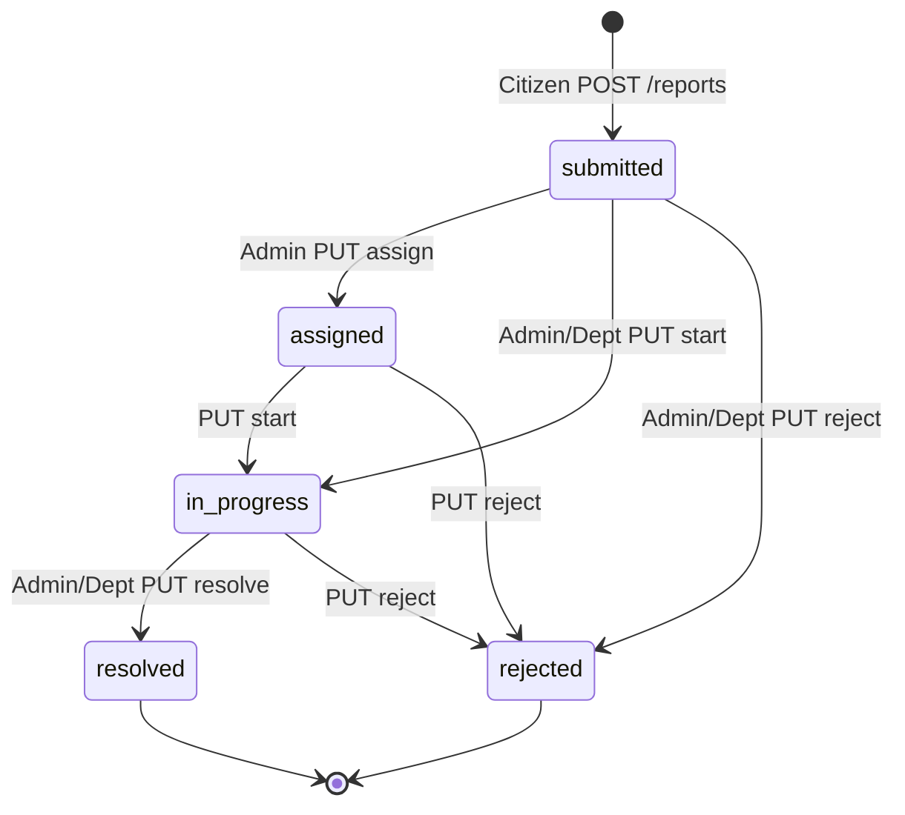
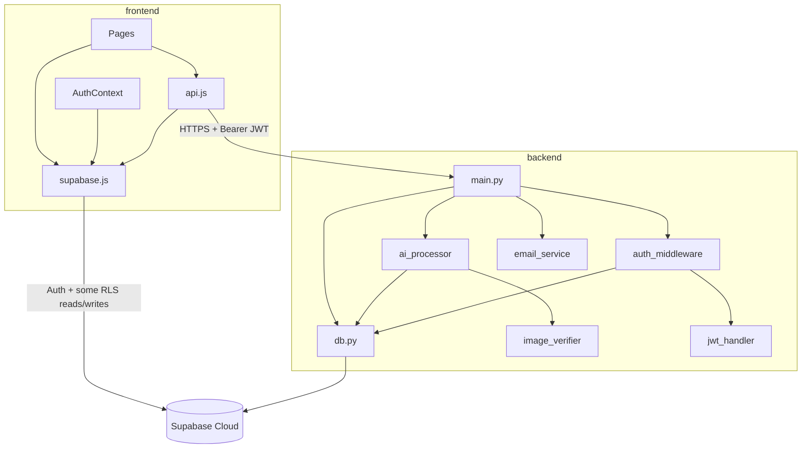
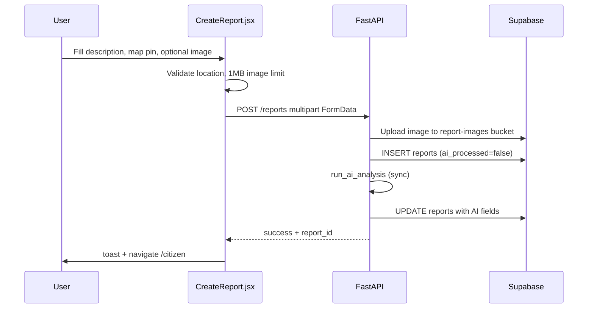
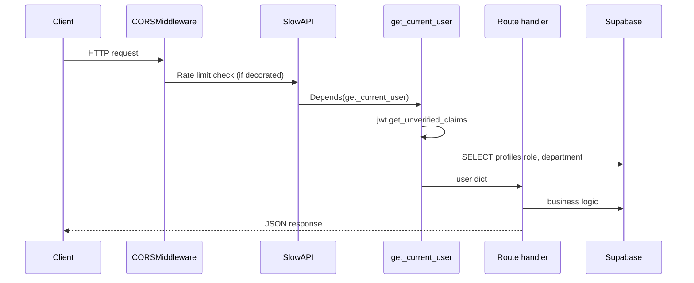
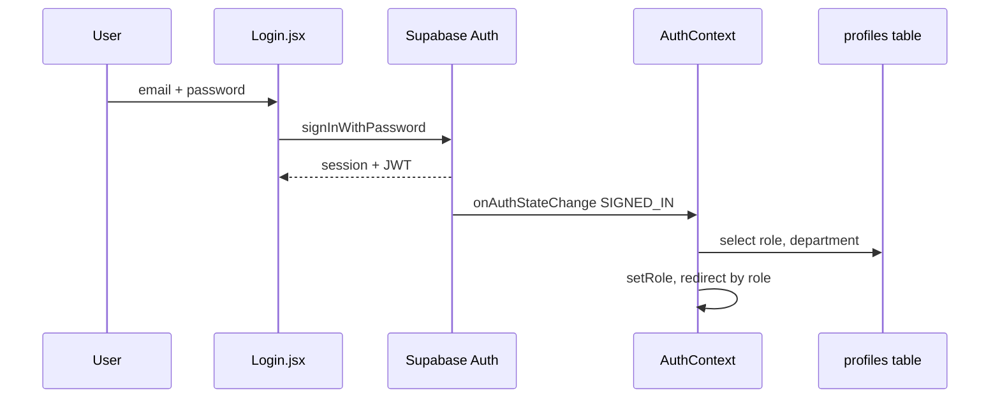
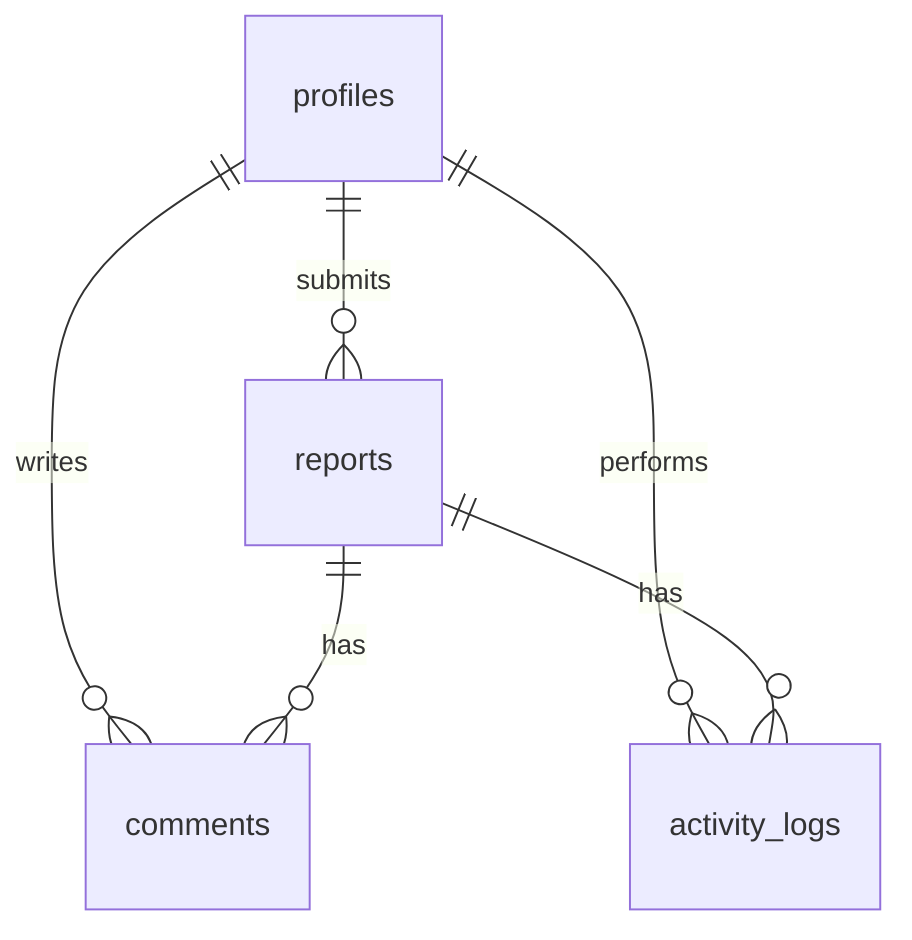
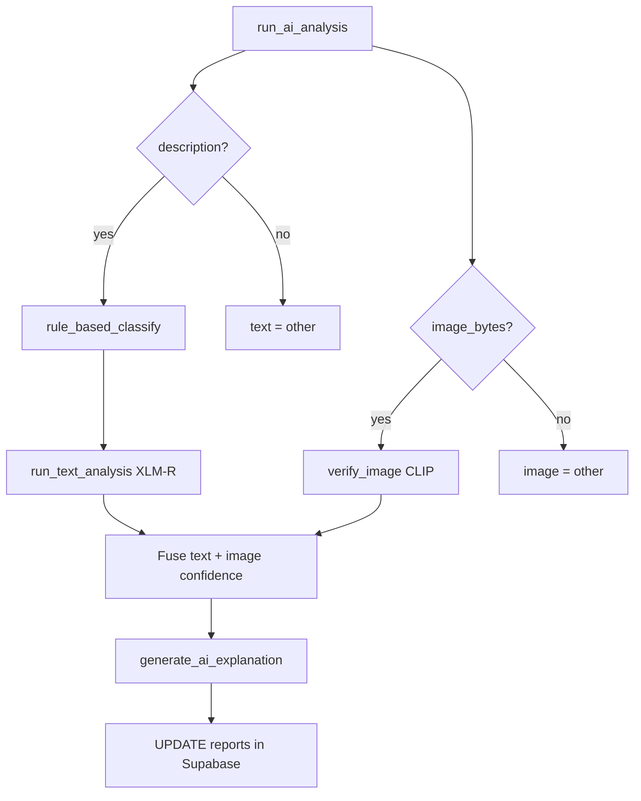
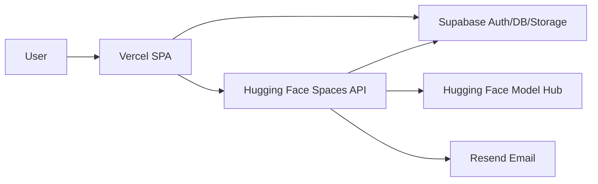
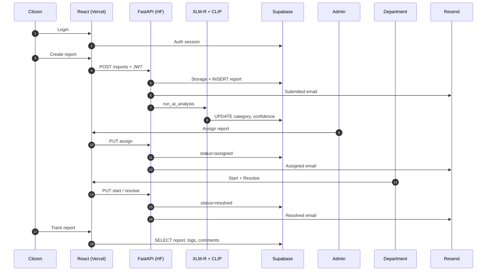

# WaterGuard — Technical Architecture Guide

> **Audience:** Project owner learning an AI-assisted codebase end-to-end.  
> **Rule:** Facts below are taken from files in this repository unless marked *Not found in repository.*

---

## Table of Contents

1. [Project Overview](#1-project-overview)
2. [Full Folder Structure](#2-full-folder-structure)
3. [Frontend Architecture](#3-frontend-architecture)
4. [Backend Architecture](#4-backend-architecture)
5. [Authentication Deep Dive](#5-authentication-deep-dive)
6. [Database Architecture](#6-database-architecture)
7. [Supabase Integration](#7-supabase-integration)
8. [AI/ML Pipeline](#8-aiml-pipeline)
9. [Dataset Analysis](#9-dataset-analysis)
10. [API Documentation](#10-api-documentation)
11. [Deployment Architecture](#11-deployment-architecture)
12. [Security Analysis](#12-security-analysis)
13. [Learning Notes](#13-learning-notes)
14. [Interview Preparation](#14-interview-preparation)
15. [Knowledge Gap Analysis](#15-knowledge-gap-analysis)
16. [End-to-End System Flow](#16-end-to-end-system-flow)

---

## 1. Project Overview

### What the project does

**WaterGuard** is a civic-tech web application for reporting and managing water-related issues (leakage, contamination, blockage, and other). Citizens submit reports with text, optional photos, and map coordinates. A **FastAPI** backend classifies reports using **XLM-RoBERTa** (text) and **CLIP** (images), stores data in **Supabase** (PostgreSQL + Storage), and notifies users via **Resend** email. **Admins** manage and assign reports; **department** workers handle reports scoped to their department.

### Problem solved

- Replaces manual triage of unstructured citizen complaints.
- Supports **multilingual** input (English, Tamil Unicode, Tanglish) via fine-tuned XLM-R and keyword rules.
- Combines **text + image** signals for category and risk.
- Provides **role-based dashboards** and status tracking for municipal workflows.

### User roles

| Role | Source | Dashboard route | Capabilities (from code) |
|------|--------|-----------------|---------------------------|
| **citizen** | `profiles.role` (default on signup) | `/citizen` | Create/edit/delete own reports (Supabase direct delete), track reports |
| **admin** | `profiles.role = 'admin'` | `/admin`, `/analytics` | List all reports, assign departments, bulk actions, resolve/reject, manage profiles |
| **department** | `profiles.role = 'department'` + `profiles.department` | `/department` | View reports where `department_name` matches; start work, resolve (optional photo) |

`ProtectedRoute` in `frontend/src/components/ProtectedRoute.jsx` enforces `allowedRoles` per route.

### Complete workflow (status machine)



**Department auto-mapping** (`backend/main.py`):

| AI category | `department_name` |
|-------------|-------------------|
| leakage | `water_dept` |
| blockage | `pwd` |
| contamination | `health_dept` |

---

## 2. Full Folder Structure

```
watergaurd-project/                    # Repository root (folder may be named my-react-app locally)
├── README.md                          # Product README, deployment notes
├── WaterGuard_Technical_Architecture_Guide.md  # This document
├── .gitignore                         # Ignores datasets, models, .env, logs, archive/
│
├── frontend/                          # React 19 SPA (Vite)
│   ├── package.json                   # npm dependencies
│   ├── vite.config.js                 # Dev server; ngrok allowedHosts
│   ├── vercel.json                    # SPA fallback to index.html
│   ├── index.html                     # Entry HTML
│   ├── tailwind.config.js
│   ├── postcss.config.js
│   ├── eslint.config.js
│   └── src/
│       ├── main.jsx                   # React root; BrowserRouter, providers
│       ├── App.jsx                    # Route definitions
│       ├── index.css                  # Global styles
│       ├── theme.js                   # Light/dark theme (localStorage)
│       ├── config/api.js              # apiFetch → FastAPI + JWT
│       ├── lib/supabase.js            # Supabase browser client
│       ├── context/
│       │   ├── AuthContext.jsx        # Session, profile, role
│       │   └── ThemeContext.jsx       # Theme state
│       ├── pages/                     # Route-level screens
│       ├── components/                # Reusable UI
│       ├── ReportForm.jsx             # Alternate report form (apiFetch)
│       └── ReportsDashboard.jsx       # Reports list helper
│
└── backend/                           # FastAPI + ML inference
    ├── main.py                        # All HTTP routes
    ├── db.py                          # Supabase Python client
    ├── ai_processor.py                # XLM-R inference, fusion, DB update
    ├── image_verifier.py              # CLIP image verification
    ├── train_model.py                 # Offline training script
    ├── training_log.txt               # Training run log (gitignored in .gitignore)
    ├── email_service.py               # Resend transactional email
    ├── logger.py                      # Rich console logging
    ├── create_report_function.py      # Duplicate snippet of create_report (not imported)
    ├── Dockerfile                     # HF Spaces: uvicorn :7860
    ├── README.md                      # HF Spaces metadata (sdk: docker)
    ├── requirements.txt               # Python deps
    └── auth/
        ├── auth_middleware.py         # get_current_user dependency
        ├── jwt_handler.py             # Decode JWT claims (unverified)
        └── security.py                # bcrypt helpers (unused in repo)
```

### Ignored / not in repository (from `.gitignore`)

| Path | Note |
|------|------|
| `archive/`, `project_archive/` | Listed in `.gitignore` — **Not found in repository** (empty or absent in workspace) |
| `backend/datasets/` | `*.jsonl` gitignored — dataset file not committed |
| `backend/models/xlmr_water_model/` | Model weights gitignored |
| `.env` files | Secrets not committed |

### Dependency relationships



---

## 3. Frontend Architecture

### Stack

| Technology | File evidence |
|------------|---------------|
| React 19 | `frontend/package.json` |
| Vite 7 | `vite.config.js`, `npm run dev` |
| React Router 7 | `App.jsx`, `main.jsx` |
| Tailwind CSS 4 | `package.json`, `tailwind.config.js` |
| Framer Motion | Page animations |
| Leaflet / react-leaflet | Maps |
| Recharts | `Analytics.jsx` |
| @supabase/supabase-js | `lib/supabase.js` |

### Pages

| File | Route | Purpose |
|------|-------|---------|
| `Landing.jsx` | `/` | Public landing; may read public stats from Supabase |
| `Login.jsx` | `/login` | Email/password + Google OAuth |
| `Signup.jsx` | `/signup` | `signUp` + email verification message |
| `ResetPassword.jsx` | `/reset-password` | `updateUser({ password })` after recovery link |
| `CitizenDashboard.jsx` | `/citizen` | Citizen's reports; delete via Supabase |
| `CreateReport.jsx` | `/create-report` | Map + form → `POST /reports` |
| `EditReport.jsx` | `/edit-report/:id` | Edit report via Supabase Storage + table |
| `TrackReport.jsx` | `/track/:reportId` | Timeline, comments via Supabase |
| `AdminDashboard.jsx` | `/admin` | Full report CRUD UI via `apiFetch` |
| `DepartmentDashboard.jsx` | `/department` | Department-scoped reports |
| `Analytics.jsx` | `/analytics` | Charts from `/reports?ai_processed=true` |
| `MapPage.jsx` | `/map` | Public map (no auth in `App.jsx`) |

### Components (major)

| Component | Role |
|-----------|------|
| `ProtectedRoute.jsx` | Auth gate + role redirect |
| `Navbar.jsx` | Navigation |
| `ReportModal.jsx` | Report detail, comments via API + Supabase realtime |
| `ReportsMap.jsx` | Heat map / markers from API |
| `ReportStepper.jsx` | Track page status UI |
| `ErrorBoundary.jsx` | React error boundary |
| `ThemeSwitcher.jsx` | Theme toggle |
| `AnimatedLogo.jsx`, `WaterBlob.jsx`, `AIBlob.jsx`, `CommunityParticles.jsx`, `TrackingRing.jsx` | Visual / branding |

### Routing

Defined in `frontend/src/App.jsx`:

- Public: `/`, `/login`, `/signup`, `/reset-password`, `/map`
- Protected with roles: `/citizen`, `/create-report`, `/edit-report/:id`, `/department`, `/admin`, `/analytics`
- Protected (any logged-in user): `/track/:reportId`

`AnimatePresence` wraps routes but route components are not all wrapped in motion containers at App level.

### State management

| Layer | Mechanism |
|-------|-----------|
| Auth | `AuthContext` — `user`, `role`, `department`, `loading` |
| Theme | `ThemeContext` + `theme.js` (localStorage) |
| Page data | Local `useState` / `useEffect` per page (no Redux/Zustand) |
| Server state | `apiFetch` + direct `supabase.from()` calls |

### API communication

`frontend/src/config/api.js`:

1. Builds URL: `VITE_API_BASE_URL + path`
2. Gets Supabase session → adds `Authorization: Bearer <access_token>`
3. Adds `ngrok-skip-browser-warning: true` header
4. 30s timeout via `AbortController`
5. Parses JSON or text; throws on non-OK

### Upload flow (citizen report)



### Map integration

| Feature | Implementation |
|---------|----------------|
| Map library | Leaflet via `react-leaflet` in `CreateReport.jsx`, `ReportsMap.jsx` |
| Tiles | OpenStreetMap (standard Leaflet setup in pages) |
| Geolocation | `navigator.geolocation` on load |
| Search | Nominatim API (`nominatim.openstreetmap.org`) — **external**, not Supabase |
| Reverse geocode | Nominatim reverse API for human-readable `location` |

---

## 4. Backend Architecture

### FastAPI structure

Single application module: `backend/main.py` (no separate `routers/` package).

| Concern | Location |
|---------|----------|
| App instance | `app = FastAPI()` |
| CORS | `CORSMiddleware`, `allow_origins=["*"]` |
| Rate limiting | `slowapi` — `10/hour` on `POST /reports` |
| Startup | `@app.on_event("startup")` → `load_nlp_model()` |
| Pydantic models | `ClassifyRequest`, `CommentRequest` inline |

Supporting modules are **imported libraries**, not FastAPI routers:

- `ai_processor.py` — ML
- `email_service.py` — Resend
- `db.py` — Supabase client
- `auth/auth_middleware.py` — dependency

### Request lifecycle (authenticated route)



### Middleware

| Middleware | Purpose |
|------------|---------|
| `SlowAPIMiddleware` | Rate limiting |
| `CORSMiddleware` | Cross-origin access for Vercel frontend |

No custom logging middleware; handlers use `logging` and `logger.py` helpers.

### Services (logical, not separate classes)

| Module | Responsibility |
|--------|----------------|
| `ai_processor.py` | Load HF model, classify, update report |
| `image_verifier.py` | CLIP scoring + rules |
| `email_service.py` | Resend HTML emails |
| `db.py` | Supabase singleton |

### Routes

All routes are in `main.py` — see [Section 10](#10-api-documentation).

**Note:** `run_ai_analysis` is called **synchronously** in the request handler despite the response message saying "background" (`main.py` line 235–239). `threading` is imported in `ai_processor.py` but **not used** for async analysis.

---

## 5. Authentication Deep Dive

### Architecture summary

| Layer | Technology |
|-------|------------|
| Identity provider | **Supabase Auth** (email/password, Google OAuth) |
| Token format | Supabase JWT access token |
| Backend verification | `python-jose` — **unverified** claim decode only |
| Password storage | **Supabase** (not `security.py`) |
| Authorization | `profiles.role` + `profiles.department` in PostgreSQL |

---

### `backend/auth/jwt_handler.py`

**Purpose:** Extract JWT payload without cryptographic verification.

```python
def decode_access_token(token: str):
    return jwt.get_unverified_claims(token)
```

**How it works:** Uses `jose.jwt.get_unverified_claims` — reads `sub`, `email`, etc. without validating signature against Supabase JWT secret.

**Why it exists:** FastAPI needs `user_id` from token before loading profile.

**What breaks if removed:** `auth_middleware.py` cannot decode tokens; all protected API routes fail.

**Security implication:** Documented in [Section 12](#12-security-analysis).

---

### `backend/auth/auth_middleware.py`

**Purpose:** FastAPI dependency `get_current_user` for protected routes.

**How it works:**

1. Read `Authorization: Bearer <token>` header.
2. Call `decode_access_token(token)`.
3. Extract `sub` → `user_id`, `email`.
4. Query `supabase.table("profiles").select("role, department").eq("id", user_id).single()`.
5. On profile error → default `role = "user"` (note: frontend expects `citizen`, not `user`).
6. Return dict: `{ user_id, email, role, department }`.

**Why it exists:** Central gate for role checks in route handlers (`user.get("role")`).

**What breaks if removed:** Cannot secure `POST /reports`, assign, resolve, etc.

---

### `backend/auth/security.py`

**Purpose:** `passlib` bcrypt `get_password_hash` / `verify_password`.

**How it works:** Standard bcrypt via `CryptContext(schemes=["bcrypt"])`.

**Why it exists:** Likely planned for custom auth; **not imported anywhere in the repository** (grep: no matches).

**What breaks if removed:** **Nothing** in current app — Supabase handles passwords.

**Password hashing in production:** Done by **Supabase Auth** on signup (`Signup.jsx` → `supabase.auth.signUp`), not this file.

---

### Login flow



**Google OAuth:** `signInWithOAuth({ provider: 'google' })` with `redirectTo: /login`. Post-login profile fetch in `Login.jsx` (partial; some redirects use `/dashboard` which is **not a defined route** in `App.jsx`).

---

### Registration flow

1. `Signup.jsx` → `supabase.auth.signUp({ email, password })`.
2. User may need email verification (message shown in UI).
3. On first login, `AuthContext.fetchUserProfile` inserts `profiles` row with `role: 'citizen'` if missing (`PGRST116`).

---

### Token validation (frontend → backend)

1. Frontend: `apiFetch` attaches Supabase session `access_token`.
2. Backend: **decode only** — no expiry/signature check in code.
3. Supabase RLS may still apply on direct client access.

---

## 6. Database Architecture

**Schema source:** Inferred from insert/select/update fields in code. **No SQL migration files found in repository.**

### Tables

#### `profiles`

| Column (in code) | Usage |
|------------------|--------|
| `id` | UUID, matches Supabase Auth `user.id` |
| `email` | Display, email notifications |
| `role` | `citizen`, `admin`, `department` |
| `department` | e.g. `water_dept`, `pwd`, `health_dept` for department users |

**Relationships:** `profiles.id` = `auth.users.id` (implicit Supabase pattern).

#### `reports`

| Column (in code) | Usage |
|------------------|--------|
| `id` | Primary key (UUID) |
| `user_id` | FK → submitter |
| `description` | Text (max 1000 chars on API) |
| `category` | leakage, contamination, blockage, other |
| `status` | submitted, assigned, in_progress, resolved, rejected (+ legacy variants) |
| `risk_level` | HIGH, MEDIUM, LOW |
| `latitude`, `longitude` | Coordinates |
| `location` | Human-readable address string |
| `image_url` | Public storage URL |
| `resolution_image_url` | After resolve with photo |
| `department_name` | Assigned department |
| `text_confidence`, `image_confidence`, `final_confidence` | AI scores |
| `image_prediction` | CLIP label |
| `ai_processed`, `ai_processed_at`, `ai_explanation` | AI metadata |
| `rejection_reason` | UI references — **insert path not found in backend** |
| `estimated_resolution` | UI references — **backend write not found** |
| `created_at`, `updated_at` | Timestamps |

#### `comments`

| Column | Usage |
|--------|--------|
| `id` | UUID |
| `report_id` | FK → reports |
| `user_id` | Author |
| `comment` | Backend API field (`CommentRequest`) |
| `content` | Used in `TrackReport.jsx` insert — **possible schema mismatch** |

#### `activity_logs`

| Column | Usage |
|--------|--------|
| `id` | UUID |
| `report_id` | FK |
| `user_id` | Actor |
| `action` | e.g. `submitted` |
| `details` | JSON object |
| `created_at` | Timeline ordering |

### Relationships (diagram)



### Foreign keys

**Not found in repository** (no SQL). Logical FKs: `reports.user_id` → `profiles.id`, `comments.report_id` → `reports.id`, `activity_logs.report_id` → `reports.id`.

### Data flow

Citizen → `reports` insert → AI update → admin assign → department work → resolve → emails + `activity_logs`.

---

## 7. Supabase Integration

### Auth

| Client | File | Key env vars |
|--------|------|--------------|
| Browser | `frontend/src/lib/supabase.js` | `VITE_SUPABASE_URL`, `VITE_SUPABASE_ANON_KEY` |
| Server | `backend/db.py` | `SUPABASE_URL`, `SUPABASE_KEY` (service role) |

Methods used: `signInWithPassword`, `signUp`, `signInWithOAuth`, `getSession`, `onAuthStateChange`, `updateUser`, `signOut`.

### Storage

| Bucket | Usage |
|--------|--------|
| `report-images` | Report photos; resolution images |

Upload paths:

- **Create report:** REST `POST` to `{SUPABASE_URL}/storage/v1/object/report-images/{uuid}.{ext}` with service key (`main.py`).
- **Resolve report:** `supabase.storage.from_("report-images").upload(...)` (`main.py`).

Public URL pattern: `{SUPABASE_URL}/storage/v1/object/public/report-images/{filename}`

### Database

Python client: `supabase-py` (`create_client` in `db.py`). All CRUD via `.table(...).select/insert/update/eq/execute()`.

Frontend also queries Supabase directly (bypassing FastAPI) for dashboards, track page, profile management — depends on **RLS policies** configured in Supabase dashboard (**policies not in repository**).

### File uploads

| Step | Location |
|------|----------|
| Client size check | 1 MB max (`CreateReport.jsx`) |
| Server extension check | jpg, jpeg, png, gif, webp |
| Storage write | Service role key on backend |

---

## 8. AI/ML Pipeline

### Models used (inference)

| Model | ID / path | File |
|-------|-----------|------|
| Text classifier | `irfan-54/waterguard-xlmr` (Hugging Face Hub) | `ai_processor.py` |
| Image verifier | `openai/clip-vit-base-patch32` | `image_verifier.py` |

### Training (`backend/train_model.py`)

| Item | Value (from code + `training_log.txt`) |
|------|----------------------------------------|
| Base model | `xlm-roberta-base` |
| Output dir | `models/xlmr_water_model` |
| Dataset path | `datasets/final_training.jsonl` |
| Total samples | **67,604** (log) |
| Train / val split | 90% / 10% stratified → **60,843 / 6,761** (log) |
| Epochs | **3** |
| Batch size | **16** |
| Learning rate | **2e-5** |
| Max length | **128** |
| Weight decay | **0.01** |
| Optimizer | **Not explicitly set** — Hugging Face `Trainer` default (**AdamW** typical; not confirmed in code) |
| Loss function | **Not explicitly set** — default for `AutoModelForSequenceClassification` is cross-entropy; **not named in repository** |
| DataCollator | **Not used** in `train_model.py` |
| Metrics | accuracy, weighted precision/recall/F1 via `sklearn` |
| FP16 | `fp16=torch.cuda.is_available()` |
| Training time | **10,422.32 s (~2h 54m)** (log line 258) |
| Best checkpoint | `load_best_model_at_end=True`, `metric_for_best_model="accuracy"` |

**Per-epoch eval (from `training_log.txt`):**

| Epoch | eval_loss | accuracy | F1 |
|-------|-----------|----------|-----|
| 1 | 0.013748 | 99.78% | 0.9978 |
| 2 | 0.002052 | 99.96% | 0.9996 |
| 3 | 0.003287 | 99.91% | 0.9991 |

**Final eval after training (log):** accuracy 0.9996, F1 0.9996.

### Inference process



**Text path priority (`classify_text` / `run_ai_analysis`):**

1. Rule-based keywords (Tamil/Tanglish/English) — may override model.
2. XLM-RoBERTa softmax → `NUMERIC_LABEL_MAP` / config `id2label`.

**Fusion rules (`run_ai_analysis`):**

- 50/50 style final score: `calculate_final_ai_score` clamps 60–95.
- If text and image disagree: prefer text unless `image_conf > text_conf + 20`.

**Risk mapping (`calculate_risk`):** contamination → HIGH; leakage/blockage → MEDIUM; other → LOW.

**Startup:** `load_nlp_model()` on server start; CLIP loads at `image_verifier` import.

### Label mapping inconsistency (important)

| Source | Label index 0 |
|--------|----------------|
| `train_model.py` / `training_log.txt` | contamination |
| `ai_processor.py` inference `id2label` | contamination (0), leakage (1), blockage (2), other (3) |
| `ai_processor.py` `NUMERIC_LABEL_MAP` (unused path) | 0: leakage, 1: contamination — **differs** |

Production inference uses `model.config.id2label` override in `load_nlp_model()` (contamination=0), matching training log.

---

## 9. Dataset Analysis

### Categories / labels

Four classes: **contamination**, **leakage**, **blockage**, **other**.

### Distribution (`training_log.txt`)

| Label | Count | Share |
|-------|-------|-------|
| contamination | 16,762 | 24.8% |
| leakage | 16,281 | 24.1% |
| blockage | 18,234 | 27.0% |
| other | 16,327 | 24.1% |

### Dataset file format (`train_model.py`)

JSONL lines: `{ "text": "...", "label": "contamination|leakage|..." }`.

**File `datasets/final_training.jsonl`:** **Not found in repository** (gitignored).

### Synthetic data generation

**Not found in repository.** README mentions "synthetic augmentation" but no generator script exists in tracked code.

### Potential causes of high accuracy (analysis, not claims)

Factors visible from codebase/logs:

1. **Large dataset** (67k+ samples).
2. **Stratified split** preserves class ratios.
3. **Keyword rules** at inference may align with training phrasing if data is templated or augmented similarly.
4. **Class overlap** between leakage/blockage in natural language may be partially resolved by heavy keyword lists in `rule_based_classify`.
5. **Validation metrics** are in-distribution; no separate held-out test set file in repo.
6. **Near-zero training loss** by epoch 2–3 in log suggests possible memorization or highly separable features — investigate with external test set (**not in repository**).

---

## 10. API Documentation

Base URL: `VITE_API_BASE_URL` (e.g. `http://127.0.0.1:8000`).

Auth column: **Bearer JWT** = Supabase access token unless noted.

| Route | Method | Auth | Input | Output |
|-------|--------|------|-------|--------|
| `/` | GET | No | — | `{ "status": "WaterGuard API running" }` |
| `/test-db` | GET | No | — | Test insert result or error |
| `/reports` | POST | **Yes** | `multipart/form-data`: `description?`, `latitude`, `longitude`, `location?`, `image?` | `{ success, report_id, category, risk_level, status }` |
| `/classify` | POST | **No** | JSON `{ "text": string }` | `{ category, confidence: 1.0, risk_level }` |
| `/stats` | GET | **No** | — | `{ total_reports, active_alerts, issues_resolved, high_risk }` |
| `/reports` | GET | **No** | Query: `page`, `limit`, `status`, `category`, `risk_level` | Paginated `data[]` + `pagination` |
| `/department/reports` | GET | **Yes** (role=department) | Query: `page`, `limit`, `status?` | Filtered by `user.department` |
| `/reports/{id}/start` | PUT | **Yes** (admin, department) | Path `report_id` | `{ status: "in_progress", department_name? }` |
| `/reports/{id}/assign` | PUT | **Yes** (admin) | Form `department` | `{ status: "assigned", department_name }` |
| `/reports/{id}/comments` | GET | **No** | Path `report_id` | `{ status, data: comments[] }` |
| `/reports/{id}/comments` | POST | **Yes** | JSON `{ "comment": string }` | `{ status, data }` |
| `/reports/{id}/resolve` | PUT | **Yes** (admin, department) | Optional `file` upload | `{ status: "resolved" }` |
| `/reports/{id}/reject` | PUT | **Yes** (admin, department) | — | `{ status: "rejected" }` |
| `/reports/{id}/timeline` | GET | **No** | Path `report_id` | `{ status, data: timeline[] }` |

### Endpoints called by frontend but **not implemented** in `main.py`

| Call | Issue |
|------|--------|
| `DELETE /reports/{id}` | `AdminDashboard.jsx` — **no backend route** |
| Query `ai_processed=true` on GET `/reports` | Passed by frontend; **backend ignores** extra query params |

---

## 11. Deployment Architecture

### Frontend

| Item | Detail |
|------|--------|
| Platform | **Vercel** (`frontend/vercel.json`) |
| Build | `npm run build` → static `dist/` |
| Routing | All paths → `index.html` (SPA) |
| Live URL (default in code) | `https://watergaurd-project.vercel.app` (`email_service.py`) |

### Backend

| Item | Detail |
|------|--------|
| Platform | **Hugging Face Spaces** (Docker SDK) |
| Config | `backend/README.md` — `sdk: docker`, `app_port: 7860` |
| Container | `Dockerfile` — Python 3.10, `uvicorn main:app --host 0.0.0.0 --port 7860` |
| Models | Downloaded from Hugging Face Hub at runtime (`from_pretrained`) |

### Environment variables

**Frontend (`import.meta.env`):**

| Variable | Purpose |
|----------|---------|
| `VITE_SUPABASE_URL` | Supabase project URL |
| `VITE_SUPABASE_ANON_KEY` | Public anon key |
| `VITE_API_BASE_URL` | FastAPI base URL |

**Backend (`os.getenv`):**

| Variable | Purpose |
|----------|---------|
| `SUPABASE_URL` | Supabase URL |
| `SUPABASE_KEY` | Service role key (storage + DB) |
| `RESEND_API_KEY` | Email |
| `EMAIL_FROM` | Sender address |
| `FRONTEND_URL` | Links in emails |
| `ENV` | `development` enables extra AI logs |

**`.env.example` files:** **Not found in repository.**

### Production flow



---

## 12. Security Analysis

### JWT security

| Issue | Detail |
|-------|--------|
| Unverified JWT | `jwt.get_unverified_claims` — no signature/expiry check |
| Risk | Forged tokens could work if attacker knows payload shape |
| Mitigation (not in code) | Verify with Supabase JWT secret or use Supabase server-side auth helpers |

### Password security

- Handled by **Supabase Auth** (signup/login).
- `security.py` bcrypt utilities are **dead code**.

### Input validation

| Area | Implementation |
|------|----------------|
| Description | Min 5 chars on create; max 1000 strip |
| Coordinates | Lat/lon bounds |
| Images | Extension whitelist; size only on frontend (1MB) |
| Rate limit | 10 reports/hour/IP on `POST /reports` |

**Missing:** HTML sanitization (only length trim); no virus scanning on uploads.

### Upload security

- Service role key used server-side for storage — **never expose `SUPABASE_KEY` to frontend**.
- Public bucket URLs for images — anyone with URL can view.

### Potential vulnerabilities

| Issue | Severity | Location |
|-------|----------|----------|
| Open CORS `*` | Medium | `main.py` |
| Unauthenticated `/reports`, `/stats`, `/classify`, comments GET, timeline | Medium–High | `main.py` |
| JWT not verified | High | `jwt_handler.py` |
| Admin DELETE calls nonexistent API | Low (feature broken) | `AdminDashboard.jsx` |
| Debug print of auth header | Low | `auth_middleware.py` |
| `get_current_user` defaults role to `"user"` vs `"citizen"` | Low | Role mismatch |
| Comments schema `comment` vs `content` | Medium | TrackReport vs API |
| Synchronous AI blocks HTTP request | Availability | `main.py` |

**RLS policies:** **Not found in repository** — critical for Supabase direct client access.

---

## 13. Learning Notes

| Concept | What it is | Why it matters | Files |
|---------|------------|----------------|-------|
| SPA + client routing | Single HTML app; React Router handles URLs | Vercel needs `vercel.json` rewrite | `App.jsx`, `vercel.json` |
| JWT Bearer auth | Token in `Authorization` header | Connects Supabase login to FastAPI | `api.js`, `auth_middleware.py` |
| FastAPI Depends | Injectable dependencies per route | Clean auth gate | `get_current_user` |
| Hugging Face Transformers | Load pretrained NLP/CV models | Core AI capability | `ai_processor.py`, `image_verifier.py` |
| Fine-tuning | Adapt XLM-R to 4 classes | Domain-specific accuracy | `train_model.py` |
| Supabase RLS | Row-level security in Postgres | Protects direct client DB access | Dashboard Supabase calls |
| Multipart upload | FormData for files | Report creation | `CreateReport.jsx`, `POST /reports` |
| Background vs sync | True async would use queue/thread | UX latency on create | `run_ai_analysis` |
| Rate limiting | slowapi per IP | Abuse prevention | `main.py` |
| Leaflet + Nominatim | Map + free geocoding | Location UX | `CreateReport.jsx` |

---

## 14. Interview Preparation

### Q1: How does a citizen report reach the database?

**A:** `CreateReport.jsx` builds `FormData` and calls `apiFetch('POST /reports')`. FastAPI validates input, uploads optional image to Supabase Storage with the service key, inserts a row into `reports` with `ai_processed: false`, calls `run_ai_analysis`, logs `activity_logs`, sends Resend email, returns `report_id`.

### Q2: Why both Supabase client and FastAPI?

**A:** Supabase Auth and some reads/writes happen in the browser (`AuthContext`, `TrackReport`, citizen delete). Heavy operations (AI, storage with service key, role-gated workflows) go through FastAPI.

### Q3: Explain the AI classification stack.

**A:** Rule-based keywords first (multilingual), then fine-tuned `irfan-54/waterguard-xlmr` for text; CLIP with prompt ensembles and 0.45 rule thresholds for images; fused confidence updates `reports` via `ai_processor.run_ai_analysis`.

### Q4: How are roles enforced?

**A:** Frontend: `ProtectedRoute` checks `allowedRoles`. Backend: `get_current_user` loads `profiles.role`; handlers compare `user.get("role")` (e.g. admin-only assign).

### Q5: What would you improve first?

**A:** Verify JWT signatures; add RLS documentation; make AI truly async; implement or remove DELETE endpoint; align comment column names; restrict open GET routes.

### Q6: Walk through training the model.

**A:** `train_model.py` loads `datasets/final_training.jsonl`, maps labels, stratified 90/10 split, tokenizes with max_length 128, trains 3 epochs with Hugging Face `Trainer`, saves to `models/xlmr_water_model`. Metrics logged in `training_log.txt`.

### Q7: What is CLIP used for?

**A:** Scores image against water-issue text prompts; rule layer maps prompts to leakage/contamination/blockage; fallback weighted category scores in `image_verifier.verify_image`.

### Q8: How is risk level determined?

**A:** `calculate_risk(category)` in `main.py` — contamination HIGH, leakage/blockage MEDIUM, other LOW. Set initially on create; category updated after AI.

---

## 15. Knowledge Gap Analysis

Study these to fully own the project:

| Topic | Gap |
|-------|-----|
| Supabase RLS & SQL schema | Policies not in repo — learn in Supabase dashboard |
| JWT verification | `python-jose` verified decode vs current unverified |
| Hugging Face Trainer API | Loss, schedulers, checkpointing |
| PyTorch inference | `eval()`, `no_grad()`, device placement |
| CLIP zero-shot classification | Prompt engineering in `image_verifier.py` |
| FastAPI async | Blocking AI in sync handler |
| Vercel + env vars | Preview vs production `VITE_*` |
| Docker / HF Spaces | Memory limits for 1GB+ models |
| CORS & OWASP API security | Open endpoints |
| React Context patterns | Auth + theme lifecycle |

---

## 16. End-to-End System Flow

### Step-by-step: User opens website → issue resolved

| Step | Actor | Action | System |
|------|-------|--------|--------|
| 1 | User | Opens `https://watergaurd-project.vercel.app` | Vercel serves React bundle |
| 2 | User | Views `/` landing | `Landing.jsx` |
| 3 | User | Sign up / login | Supabase Auth; `profiles` row created if new |
| 4 | User | Redirected to `/citizen` | `AuthContext` + `ProtectedRoute` |
| 5 | User | Opens Create Report | `/create-report` |
| 6 | User | Selects map location (GPS or Nominatim search) | Leaflet + OpenStreetMap Nominatim |
| 7 | User | Enters description + optional photo (≤1MB) | Client validation |
| 8 | App | `POST /reports` with JWT | FastAPI rate limit → storage upload → DB insert |
| 9 | API | Sends "report received" email | Resend |
| 10 | API | `run_ai_analysis` | XLM-R + CLIP → UPDATE `reports` |
| 11 | API | `log_activity` submitted | `activity_logs` |
| 12 | User | Sees report on citizen dashboard | Supabase `select` where `user_id` + `ai_processed` |
| 13 | Admin | Lists `/reports` on admin dashboard | `GET /reports` (unauthenticated in backend) |
| 14 | Admin | Assigns to department | `PUT /reports/{id}/assign` |
| 15 | System | Assignment email | Resend |
| 16 | Dept | Views `/department/reports` | Filtered by `department_name` |
| 17 | Dept | Starts work | `PUT /reports/{id}/start` → `in_progress` |
| 18 | Dept | Resolves (optional photo) | `PUT /reports/{id}/resolve` → storage + status |
| 19 | System | Resolved email | Resend |
| 20 | Citizen | Tracks `/track/:reportId` | Supabase read report, logs, comments |
| 21 | — | Data persisted | Supabase PostgreSQL + Storage |

### Master sequence diagram



---

## Appendix A: `create_report_function.py`

This file contains a **partial duplicate** of `create_report` (starts at `@app.post` without imports). It is **not imported** by `main.py`. Treat as scratch/legacy — safe to ignore for runtime behavior.

## Appendix B: Orphan / legacy frontend files

| File | Note |
|------|------|
| `ReportForm.jsx` | Alternate report submission UI |
| `ReportsDashboard.jsx` | Simple reports list |

Verify usage before deleting; **not mounted in `App.jsx` routes**.

---

*Document generated from repository analysis. Last aligned with codebase structure under `frontend/` and `backend/`.*
